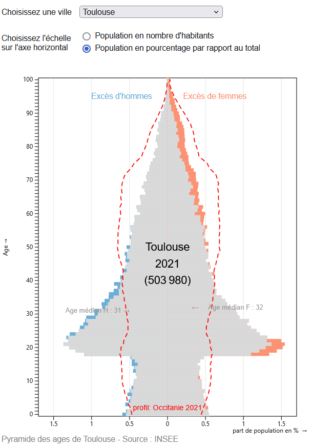

# data_preparation_population
Ce notebook jupyter met les données du fichier POP_1B - population par sexe et par âge - de l'INSEE dans une forme adéquate pour réaliser des pyramides des âges. 

le fichier POP_1B_2021.xlsx est téléchargeable sur la page de l'INSEE [Population en 2021 Recensement de la population - Base des tableaux détaillés](https://www.insee.fr/fr/statistiques/8202264?sommaire=8202287)

Le traitement consiste à : 
- Créer une colonne nbr d'hommes dans la commune 
- Créer une colonne nbr de femmes dans la commune 
- d'ajouter pour chaque commune les colonnes : code_dept, nom_departement, code_reg, nom_region 
- de selectionner toutes les communes d'une région (par défault 76 pour l'Occitanie)
- de sélectionner les 25 communes les plus peuplées de la région 
- transposer les colonnes par âge en trois colonnes : Age, Nb_H et NbF

- créer un fichier csv charger dans l'application observable [population-de-villes-doccitanie-en-2021](https://observablehq.com/@tdvz/population-de-villes-doccitanie-en-2021)

- Placer le Le fichier .ipynb dans répertoire 
- Dans ce repertoire créer un dossier data et y placer les données data de ce repository.
- Toujours dans ce repertoire créer un dossier result.  
